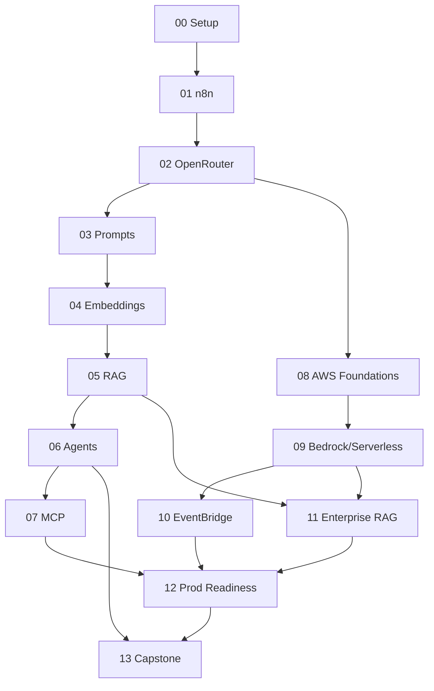

# Syllabus — AI Workflow Engineering

**Total guided time:** ~48–56 hours of content (lectures + labs + assignments).
**Format:** Modular. Each module is independently teachable but assumes the prerequisite chain below.

---

## Learning paths

| Path | Audience | Modules | Duration |
|------|----------|---------|----------|
| **Fast start (no-code AI)** | Ops/automation | 00 → 06 | ~3 days |
| **Full engineer track** | Engineers | 00 → 13 | ~12 weeks (part-time) |
| **Architect track** | Architects/leads | 00, 02, 05, 07, 08–13 | ~2 weeks |
| **3-day bootcamp** | Mixed | 00–02 (day 1), 03–06 (day 2), 08–09 + 12 (day 3) | 3 days |

---

## Module map

### Stage 1 — Learn workflow automation on existing platforms (n8n + OpenRouter)

| # | Module | Core outcomes | Est. |
|---|--------|---------------|------|
| 00 | **Course Intro & Environment Setup** | Local lab (Docker: n8n + Postgres + Qdrant), accounts, secrets hygiene, repo conventions | 2.0h |
| 01 | **n8n Fundamentals & SOLID Workflow Design** | Nodes, triggers, data flow, expressions, error workflows, reusable sub-workflows | 4.0h |
| 02 | **LLMs & OpenRouter Integration** | Model routing, chat/completions, streaming, retries, cost/latency trade-offs | 4.0h |
| 03 | **Prompt Engineering & External Prompt Libraries** | System/user prompts, few-shot, structured output, versioned prompt store | 4.0h |
| 04 | **Embeddings & Vector Databases** | Embeddings, chunking, Qdrant, similarity search, metadata filtering | 4.5h |
| 05 | **RAG Pipelines** | Ingestion, retrieval, grounding, citations, evaluation, guardrails | 5.0h |
| 06 | **AI Agents, Tool Calling & Memory** | Tool/function calling, ReAct loops, short/long-term memory, guardrails | 5.0h |
| 07 | **Model Context Protocol (MCP)** | MCP servers/clients, tool exposure, n8n + MCP, security boundaries | 4.0h |

### Stage 2 — Design and implement the enterprise platform on AWS

| # | Module | Core outcomes | Est. |
|---|--------|---------------|------|
| 08 | **AWS Foundations for AI** | IAM least-privilege, Secrets Manager, S3, DynamoDB, CloudWatch basics | 4.5h |
| 09 | **Bedrock + Serverless AI** | Bedrock models, Lambda, Step Functions, API Gateway, Cognito auth | 5.5h |
| 10 | **Event-Driven AI Orchestration** | EventBridge, async pipelines, DLQs, idempotency, saga patterns | 4.5h |
| 11 | **Enterprise RAG on AWS** | Bedrock Knowledge Bases, OpenSearch Serverless, ingestion pipelines | 5.0h |
| 12 | **Production Readiness** | Security, governance, observability, scalability, cost optimization, FinOps | 5.0h |
| 13 | **Capstone** | End-to-end enterprise AI assistant, hybrid n8n↔AWS, graded rubric | 8.0h+ |

---

## Prerequisite graph

---

## Assessment model

- **Per-module quiz** (10–20 questions): checks conceptual understanding. Pass ≥ 80%.
- **Per-module practical assignment**: graded against a rubric in the assignment file.
- **Capstone**: an end-to-end build graded on architecture, security, observability,
  cost-awareness, and documentation (rubric in `modules/13-capstone/`).

## Tooling & accounts required

| Tool | Part I | Part II | Notes |
|------|:-----:|:------:|-------|
| Docker Desktop | ✅ | ✅ | Local n8n/Qdrant/Postgres stack |
| n8n (self-hosted) | ✅ | ✅ | Community edition is sufficient |
| OpenRouter account + API key | ✅ | optional | Model access with unified billing |
| AWS account | — | ✅ | Bedrock model access must be enabled per-region |
| Node.js ≥ 20 | ✅ | ✅ | Validation/helper scripts |
| AWS CLI v2 + SAM/CDK | — | ✅ | IaC for Part II |

Cost note: Part II labs are designed to fit within low double-digit USD if you tear down
resources after each module. Every AWS module includes a **teardown checklist**.
